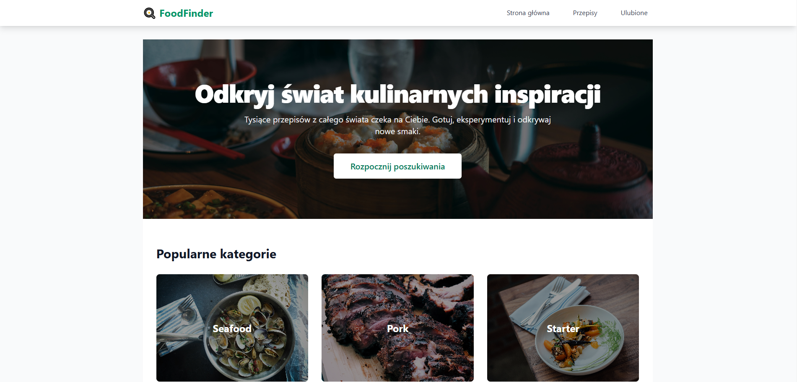
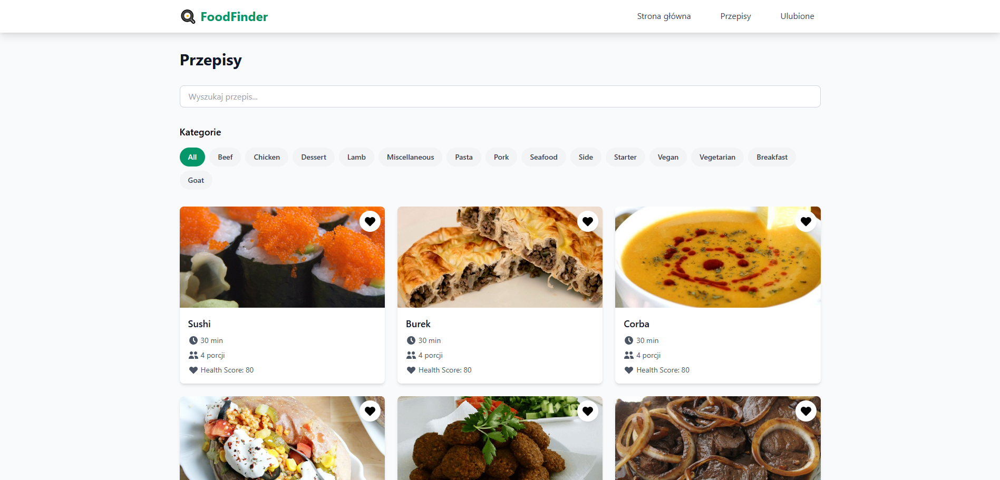
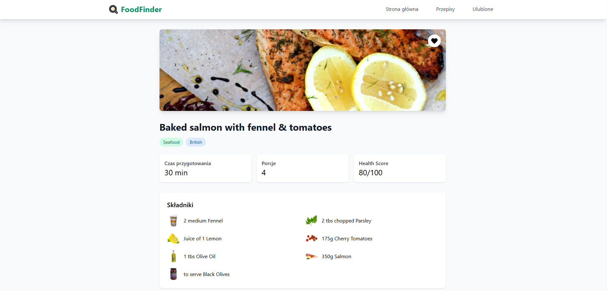
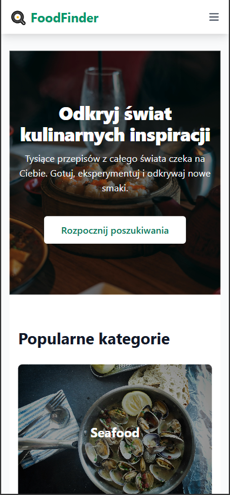
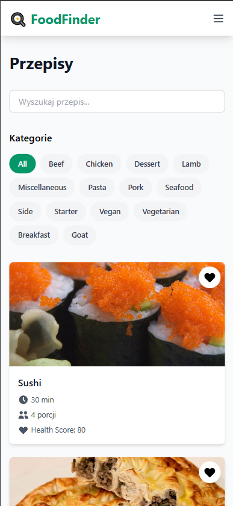
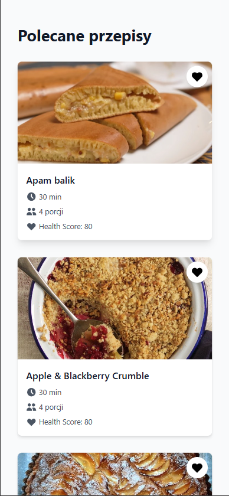
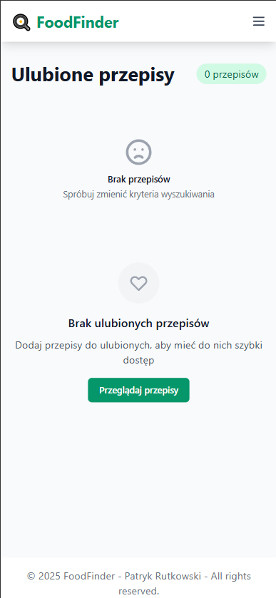
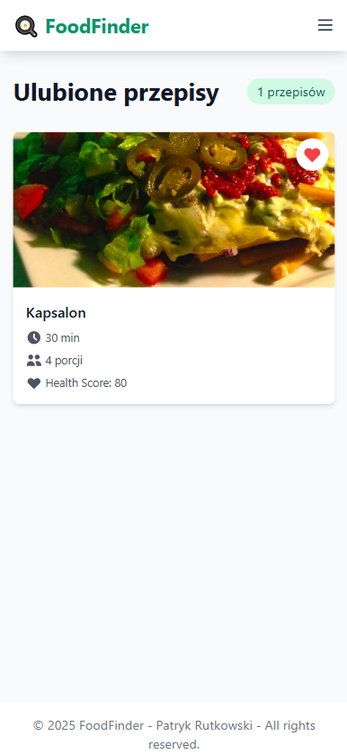

# 🍳 FoodFinder

<div align="center">
 
</div>

## 📱 Responsive Design

Aplikacja została zaprojektowana z myślą o różnych urządzeniach, zapewniając idealne dopasowanie zarówno na komputerach stacjonarnych, tabletach jak i telefonach komórkowych. Dzięki zastosowaniu nowoczesnych technik RWD (Responsive Web Design) i frameworka TailwindCSS, interfejs automatycznie dostosowuje się do rozmiaru ekranu, zachowując pełną funkcjonalność i estetykę na każdym urządzeniu.

### Główne cechy RWD:
- 📱 Elastyczny układ dostosowujący się do szerokości ekranu
- 📊 Responsywna nawigacja zmieniająca się w menu mobilne
- 🖼️ Dynamicznie skalujące się obrazy
- 📍 Zoptymalizowane odstępy i wielkości elementów

## 🎯 O Projekcie

FoodFinder to aplikacja webowa do wyszukiwania i przeglądania przepisów kulinarnych. Została stworzona jako Single Page Application (SPA) w ramach projektu zaliczeniowego.

### ✨ Główne Funkcjonalności
- 🔍 Dynamiczne wyszukiwanie przepisów w czasie rzeczywistym
- 📂 Filtrowanie przepisów według kategorii (np. Beef, Chicken, Dessert)
- ❤️ System ulubionych przepisów z zapisem lokalnym
- 🔄 Paginacja wyników wyszukiwania
- 📱 Responsywny design (RWD)
- 🎥 Integracja z filmikami instruktażowymi YouTube
- 📝 Szczegółowe widoki przepisów z listą składników i instrukcjami

## 🛠️ Technologie i Narzędzia

### Frontend
- **Vue.js 3** - framework JavaScript z Composition API
- **TypeScript** - typowany superset JavaScript
- **Pinia** - zarządzanie stanem aplikacji
- **Vue Router** - routing na poziomie frontendu
- **TailwindCSS** - utility-first framework CSS

### API i Integracje
- **TheMealDB API** - zewnętrzne API dostarczające dane o przepisach
- **YouTube** - integracja z filmami instruktażowymi

### Narzędzia
- **Vite** - buildowanie i development
- **Git** - kontrola wersji
- **GitHub Pages** - hosting

## 📂 Struktura Projektu

```plaintext
src/
├── assets/         # Statyczne zasoby
├── components/     # Komponenty Vue
│   ├── layout/     # Komponenty układu strony
│   └── recipe/     # Komponenty związane z przepisami
├── router/         # Konfiguracja routingu
├── services/       # Serwisy (API)
├── stores/         # Store Pinia
├── types/          # Typy TypeScript
└── views/          # Widoki/strony
```

## 🚀 Uruchomienie Projektu

1. Sklonuj repozytorium:
```bash
git clone https://github.com/paruut/Food-Finder.git
cd Food-Finder
```
2. Zainstaluj zależności:
```bash
npm install
```

3. Uruchom serwer deweloperski:
```bash
npm run dev
```
4. Otwórz aplikację w przeglądarce:
```bash
http://localhost:5173
```

## 📸 Zrzuty ekranu

### 🖥️ Widok Desktop

<div align="center">
  
  <p><em>Strona główna</em></p>
</div>

<div align="center">
  
  <p><em>Lista przepisów z filtrowaniem kategorii</em></p>
</div>

<div align="center">
  
  <p><em>Szczegółowy widok przepisu</em></p>
</div>

<div align="center">
  
  <p><em>Lista ulubionych przepisów</em></p>
</div>

### 📱 Widok Mobile

<div class="mobile-screenshots" style="display: flex; justify-content: center; gap: 20px; flex-wrap: wrap;">
  <div align="center">
    
    <p><em>Strona główna</em></p>
  </div>
  
  <div align="center">
    
    <p><em>Lista przepisów</em></p>
  </div>

  <div align="center">
    
    <p><em>Polecane przepisy</em></p>
  </div>

  <div align="center">
    
    <p><em>Szczegóły przepisu</em></p>
  </div>

  <div align="center">
    
    <p><em>Puste ulubione</em></p>
  </div>

  <div align="center">
    
    <p><em>Ulubione przepisy</em></p>
  </div>
</div>

## 👨‍💻 Autor

**Patryk Rutkowski**
- GitHub: [@paruut](https://github.com/paruut)
- Index: 160562


